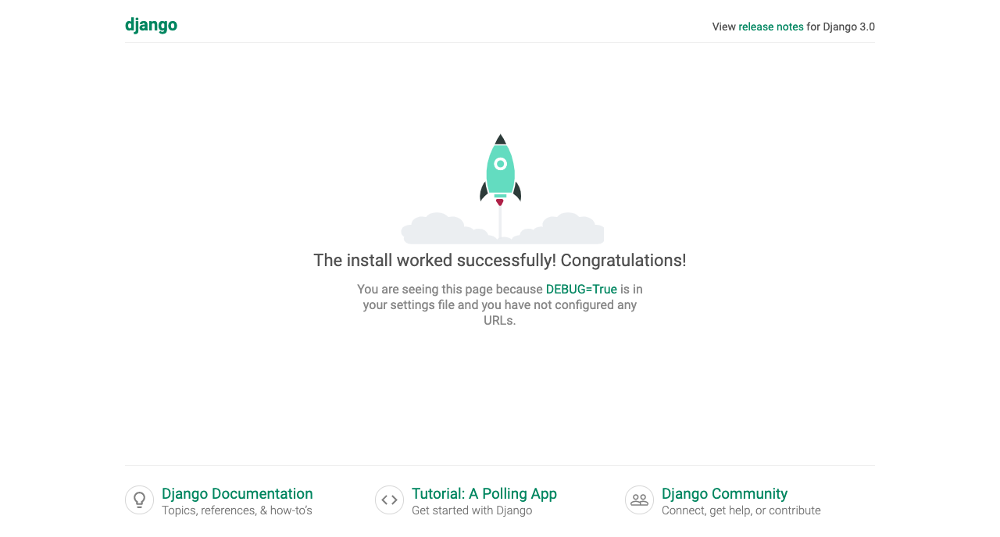
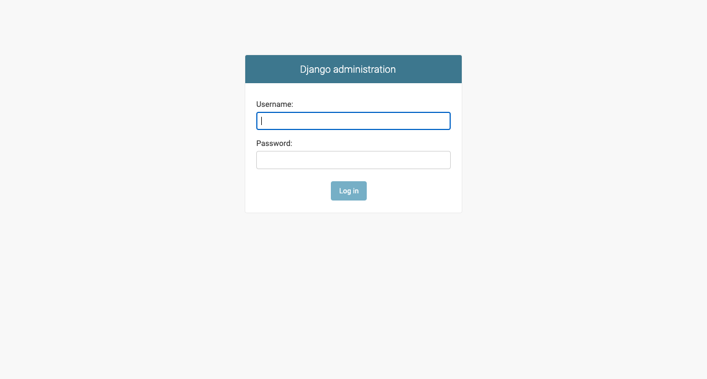
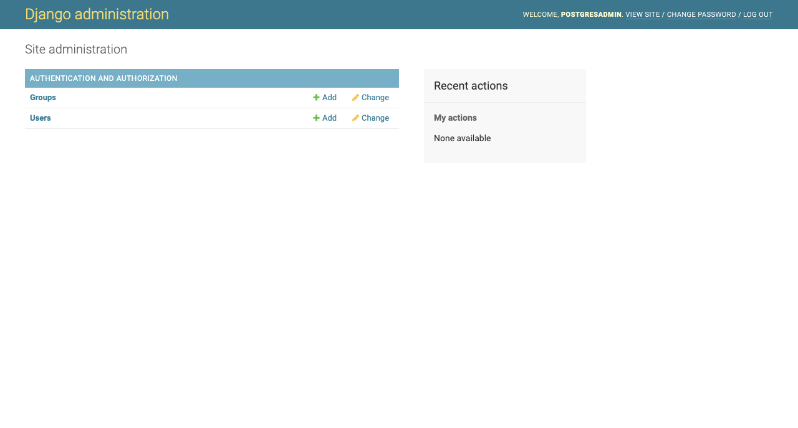

# Django PostgresQL
This is a guide on how to change from the initial db.sqlite3 provided by default in Django and replace it with PostgresQL using Docker, which is more convinent for production, However this
database is also usable locally.
Django supports SQLite, ORACLE, MySQL, and PostgeSQL, and thanks to Django ORM it is possible to work using almost the same code no matter what database we decide to chose.

## Start new Django project
In your terminal, Let`s create the main folder and the new django project. Then open it in your favorite IDE.

````
$mkdir postgresql
$cd postgresql
$pipenv install DJANGO==3.0.1
$pipenv shell
(postgresql)$django-admin startpoject postgresql_project . "#the . help us to not create unnecessary subfolder" 
(postgresql)$python manage.py migrate
(postgresql)$python manage.py runserver
(postgresql)$code -n .
````
check your [http://localhost:8000/](http://localhost:8000/) you will find
  


## Docker

Exit the pipenv and create docker files

````
(postgresql)$exit
$touch Dockerfile
$touch docker.compose.yml

````
In Docker file fill dependencies:

````
# Dockerfile
# Pull base image
FROM python:3.7

# Set environment variables
ENV PYTHONDONTWRITEBYTECODE 1
ENV PYTHONUNBUFFERED 1

# Set work directory
WORKDIR /code

# Install dependencies
COPY Pipfile Pipfile.lock /code/
RUN pip install pipenv && pipenv install --system

# Copy project
COPY . /code/
``````
Build the initial image by running:
``docker build ."

In docker-compose.yml

`````
version: '3.7'

services:
  web:
    build: .
    command: python /code/manage.py runserver 0.0.0.0:8000
    volumes:
      - .:/code
    ports:
      - 8000:8000
 `````
 
 ## Detached Mode
  Help us to tun containers in the background, we can use the same command line tab without opening a new one. To do so, we specify the flag -d or -detach;
  
  ``$docker-compose up -d``
 
 ## PostgreSQL
 Now, let's change our database to postgreSQL using pyscopg2, a python DB adapter. Then we will change our settings and finally run the project locally.
 But first, stop the Docker and update the DOCKERFILE to specify POSTGRES_HOST_AUTH_METHOD=trust which is convenient for testing purposes.
 
``$docker-compose down``

Add in docker file
`````
version: '3.7'

services:
  web:
    build: .
    command: python /code/manage.py runserver 0.0.0.0:8000
    volumes:
      - .:/code
    ports:
      - 8000:8000
    depends_on:
      - db
  db:
    image: postgres:11
    environment:
      - "POSTGRES_HOST_AUTH_METHOD=trust"
`````
Now create the docker image again to get the changes.

``$docker-compose up -d``

## setting.py

Now, with the new image running let's tell Django to use PostgreSQL instead of SQLite db. The port 5432 is the default for PostgrestQL.

`````
DATABASES = {
    'default': {
        'ENGINE': 'django.db.backends.postgresql',
        'NAME': 'postgres',
        'USER': 'postgres',
        'PASSWORD': 'postgres',
        'HOST': 'db',
        'PORT': 5432
    }
}
`````
I know, it not working!, but relax, if you check your logs in docker you will realize we haven't installed the pyscopg2 yet.

``$docker-compose logs``

## Pyscopg
So, let's install pyscopg2. It's a good practice to specify the version, so every time we run a new image we will have the same and not an
updated version that can crash our project. We install it directly docker and not in our local to avoid conflict with our Pipfile.lock

``$docker-compose exec web pipenv install pyscopg2-binary==2.8.4``
 Now stop the current image and create a new one with pyscopg2 installed
`````
$docker-compose down
$docker-compose up -d --build
`````

## Create new Database

Now with everything installed, let's create a new user in our new PostgreSQL database and login into the Django Admin.

`````
$docker-compose exec web python manage.py migrate
$docker-compose exec web python manage.py createsuperuser
`````
Fill the form and go to your admin you will find [http://localhost:8000/admin](http://localhost:8000/admin)
  
  
 log in and start your project, Cheers Good Luck 🍻!
   
   
## Sources
+ [Docker](https://www.docker.com/)
+ [pipenv](https://pypi.org/project/pipenv/)
+ [psycopg2](https://pypi.org/project/psycopg2/)
+ [Django for Professionals](https://wsvincent.com/)
